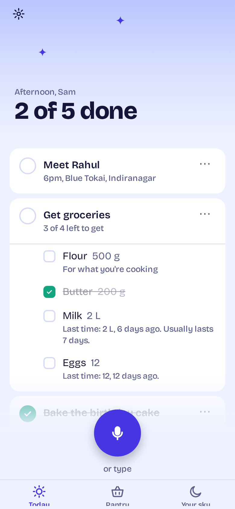
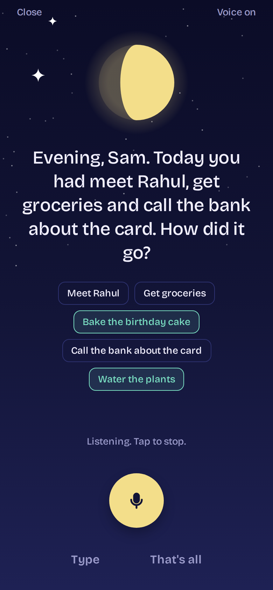
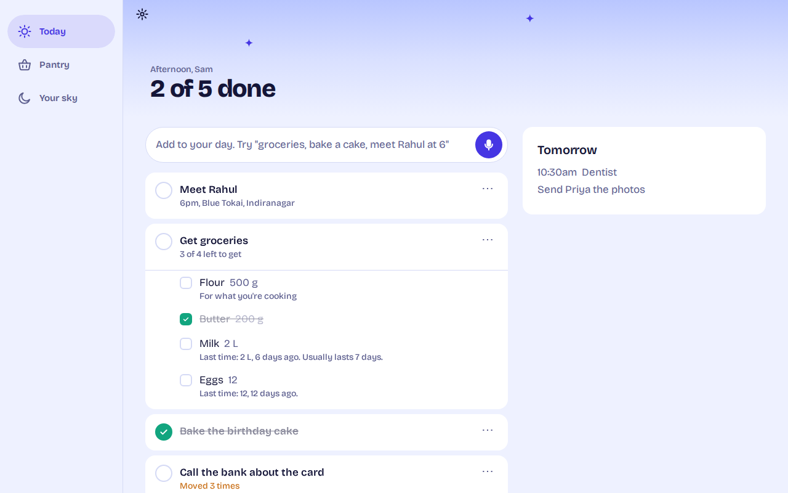

# Tuck

**Plan out loud. Sleep with a clear head.**

Tuck is a voice-first to-do planner for everyday life. Say everything on your plate in one breath ("get groceries, bake a cake and meet Rahul at 6") and it becomes separate tasks, with timed ones added to Google Calendar. At bedtime Tuck checks in: you tell it what got done, it carries over what didn't, and it remembers what you bought so your next grocery list writes itself.

Runs on **iOS, Android and the web** from one Expo (React Native) codebase.

| Phone | Bedtime check-in | Desktop |
|---|---|---|
|  |  |  |

## What makes it different

1. **Bedtime check-in by voice.** A one-minute conversation, not a checklist. Tuck speaks, you answer, it updates everything.
2. **Honest carry-over.** Tasks you keep pushing get a gentle question: break it down, give it a time, or let it go.
3. **Your day ends when you go to bed.** Anything before 4am still counts as the previous day.
4. **Grocery memory.** "Last time: 2 L, 6 days ago. Usually lasts 7 days." Learned from what you tick off or mention at bedtime.
5. **A streak that doesn't punish you.** The moon fills over seven nights; each full moon saves a grace night.

See [docs/PRODUCT.md](docs/PRODUCT.md) for the market research and [docs/DESIGN.md](docs/DESIGN.md) for the design system.

## Repo layout

```
apps/
  api/      Node + Fastify + Postgres (Drizzle) + Claude API
  mobile/   Expo SDK 57 app: iOS, Android, web
docs/       product research, design system, screenshots
```

## Run it locally

You need Node 22+, a Postgres database, and an Anthropic API key.

```bash
npm install

# 1. API
cp apps/api/.env.example apps/api/.env      # add DATABASE_URL and ANTHROPIC_API_KEY
npm run db:push                             # create tables
npm run api                                 # http://localhost:8787

# Optional: fill a demo user with a few weeks of history
npm run seed -w apps/api -- demo Asia/Kolkata

# 2. App
cp apps/mobile/.env.example apps/mobile/.env
npm run mobile                              # then press w (web), i (iOS) or a (Android)
```

Voice input needs a development build on phones, because speech recognition is a native module that Expo Go doesn't include:

```bash
cd apps/mobile
npx expo run:ios        # or: npx expo run:android
```

On the web, voice works in Chrome, Edge and Safari. Other browsers fall back to typing automatically.

On a physical phone, set `EXPO_PUBLIC_API_URL` to your computer's LAN address (e.g. `http://192.168.1.20:8787`).

## Accounts

The app signs people in anonymously with Supabase first (no sign-up wall) and they can attach an email later. Set `SUPABASE_URL` on the API and `EXPO_PUBLIC_SUPABASE_URL` / `EXPO_PUBLIC_SUPABASE_ANON_KEY` in the app, and turn on anonymous sign-ins in Supabase. For local development leave them empty: the API accepts an `x-dev-user` header when `ALLOW_DEV_AUTH=true`. **Never enable dev auth in production.**

## Google Calendar

1. In Google Cloud, create an OAuth client of type "Web application" and enable the Google Calendar API.
2. Add `http://localhost:8787/google/callback` (and your production API URL) as an authorized redirect URI.
3. Fill in `GOOGLE_CLIENT_ID`, `GOOGLE_CLIENT_SECRET`, `GOOGLE_REDIRECT_URI` and `WEB_APP_ORIGINS` in `apps/api/.env`.

Tasks with a time are written to the calendar and kept in sync; your existing events show on the Today screen.

## Reminders by platform

| | Bedtime reminder |
|---|---|
| iOS, Android | Local notification every day at bedtime, even when the app is closed |
| Web | Browser notification while Tuck is open in a tab (browsers can't schedule alarms for closed tabs); the Today screen also shows "Ready to tuck in?" near bedtime |

## Deploy

- **API:** any Node host (Railway, Render, Fly.io) plus a Postgres (Supabase, Neon). `npm run build -w apps/api && npm start -w apps/api`.
- **Web app:** `npm run build:web -w apps/mobile` produces a static site in `apps/mobile/dist`. Host it on Vercel, Netlify or Cloudflare Pages with a single-page-app fallback to `index.html`.
- **Phone apps:** `npx eas build` from `apps/mobile`, then submit with `npx eas submit`.

## Checks

```bash
npm run typecheck -w apps/api
npm test -w apps/api
npm run typecheck -w apps/mobile
```

## API at a glance

| Method | Path | What it does |
|---|---|---|
| GET | `/me` | Profile, streak, moon phase, calendar status |
| GET | `/days/today` | Today, tomorrow and calendar events |
| POST | `/capture` | Free text or a voice transcript in, tasks out |
| PATCH | `/tasks/:id` | Complete, move, rename |
| PATCH | `/items/:id` | Tick a shopping item (also records the purchase) |
| POST | `/checkin/start` · `/checkin/reply` · `/checkin/finish` | The bedtime conversation |
| GET | `/pantry` | Grocery memory with "days left" estimates |
| POST | `/shopping/add` | Put a pantry item on the next shopping list |
| GET | `/google/connect` | Start Google Calendar sign-in |
